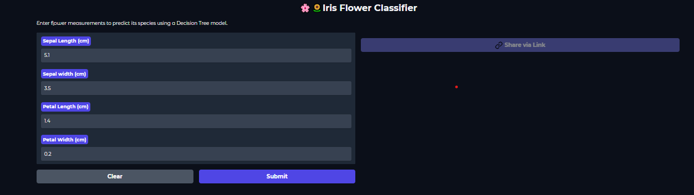

**IRIS SPECIES PREDICTION MODEL**

Use can access the live application by clicking on the link provided 
                     👉 https://huggingface.co/spaces/Johan45/Flower-Predicition-App 👈

📌📋 Introduction

This project is a web application designed to predict the species of an Iris flower based on its sepal length, sepal width, petal length, and petal width. It leverages a machine learning model trained on the famous Iris dataset to provide accurate classifications, helping users identify whether an Iris flower belongs to the 'setosa', 'versicolor', or 'virginica' species.

🎈🧧 Features

User-friendly Interface: Simple and intuitive web interface for inputting flower measurements.

Real-time Predictions: Get instant predictions of Iris flower species.

Clear Results: Displays the predicted species and potentially the confidence score.

🛠✨ Technologies Used

Python: The core programming language.

Scikit-learn: For machine learning model training and prediction (e.g., LogisticRegression, Decision Tree).

NumPy: For numerical operations.

HuggingFace🤗🤗 / Gradio: For building the web application.

Matplotlib/Seaborn for visualization

⚽📜 Dataset

The application utilizes the classic Iris dataset. This dataset contains 150 samples of Iris flowers, each with four features:

Sepal Length (cm)

Sepal Width (cm)

Petal Length (cm)

Petal Width (cm)

The dataset is categorized into three species: Iris setosa, Iris versicolor, and Iris virginica.

🔗🔗 Installation

To set up the project locally, follow these steps:

Clone the repository:

git clone https://github.com/Johan621/Iris_prediction_App.git

cd Iris_prediction_App

Create a virtual environment (recommended):

python -m venv venv
# On Windows:
.\venv\Scripts\activate
# On macOS/Linux:
source venv/bin/activate

Install the required dependencies:

pip install -r requirements.txt

Usage

Run the application:

python app.py # Or whatever your main application file is named

Make predictions:
Enter the sepal length, sepal width, petal length, and petal width in the provided input fields and click the "Predict" button to see the predicted Iris species.

Below is the picture of the live demo of application 👇👇:

